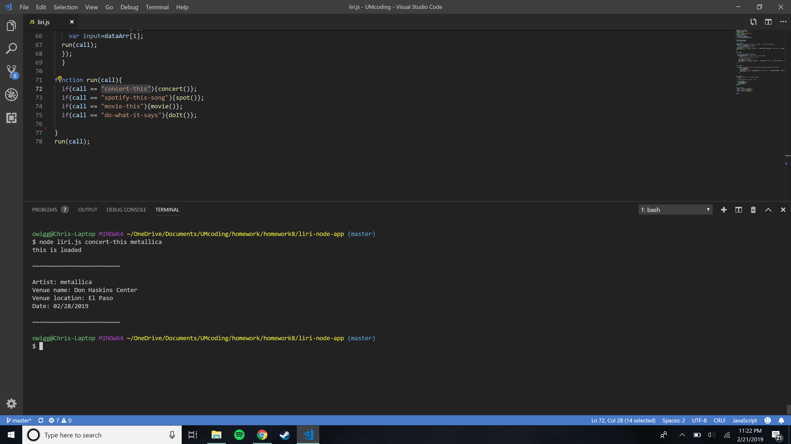
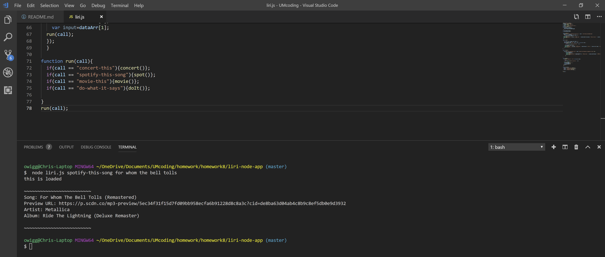
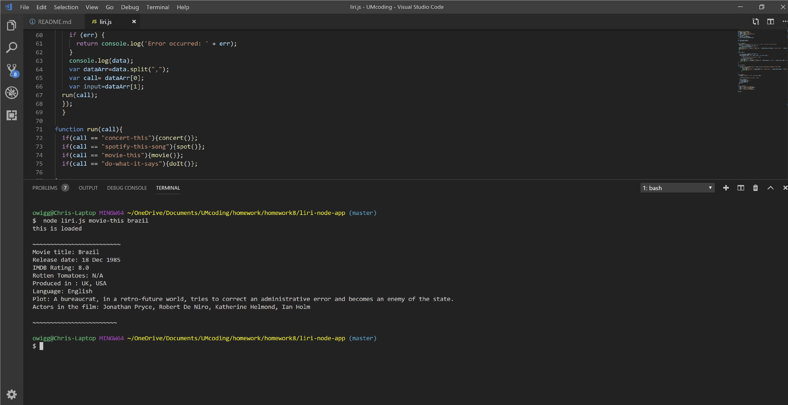
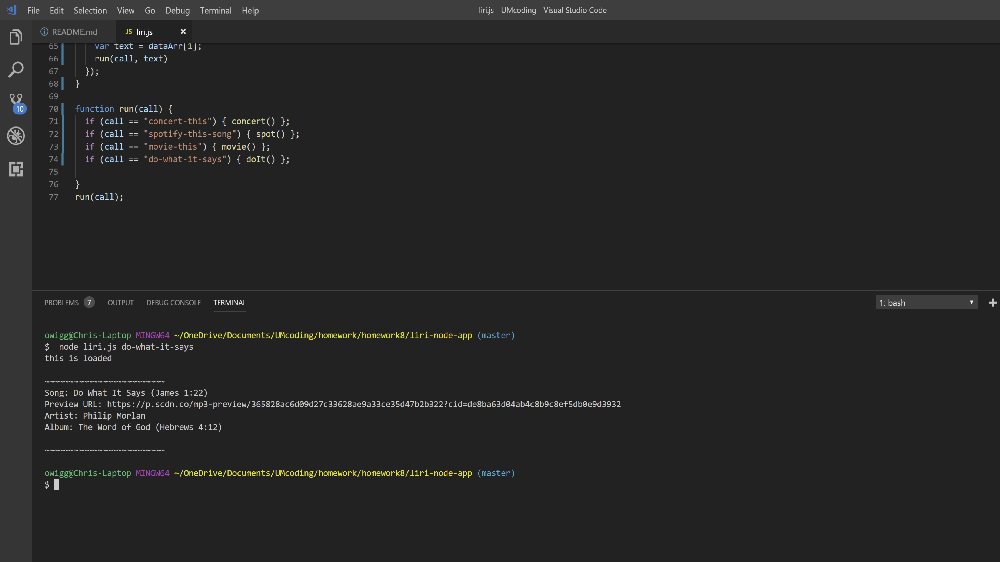

# liri-node-app

This Liri Node app is a command line app which uses multiple API's and databases to pull information based on user queries.

Use the query "concert-this" followed by a band to find their next concert.

;

Use the query "spotify-this-song" followed by a song name to find out info of the song.

;

Use the query "movie-this" followed by a movie title to find more about the film.

;

Use the query "do-what-it-says" to run a call that pulls information from random.txt

;